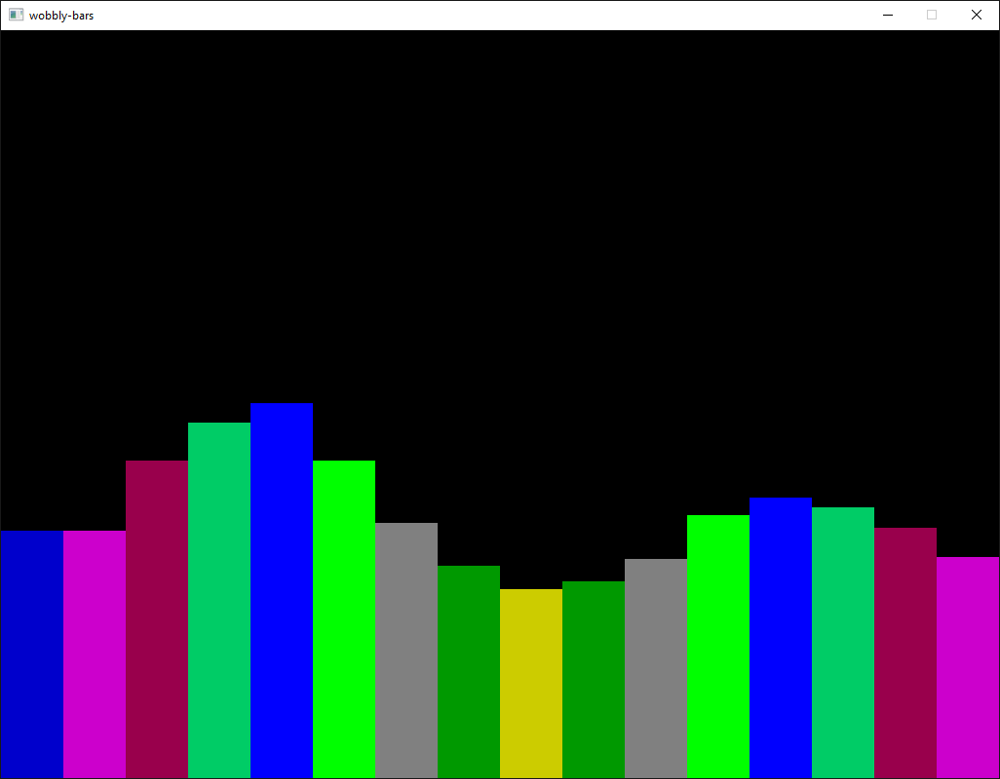

# wobbly-bars
## A little physics-related toy, written in Rust using [rust_minifb](https://github.com/emoon/rust_minifb)
### © 2017 William Eustace, MIT licensed (see licence)
The initial version of this app, which displays a series of coloured bars on a screen which are modelled as viscously damped mass-spring oscillators, was a couple of hours' work: an afternoon has since been spent splitting the "physics engine" onto a separate thread. When the cursor is above (in the y-axis on screen) or over them, and the mouse button is pressed, a force is applied upwards on them; when it moves away or the button is released, they bounce back again.

Screenshot of wobbly-bars in action.

I *strongly recommend* building in release mode (run `cargo build --release` and use the executable in `./target/release`). There is a very dramatic performance improvement.

The frame rate of the physics engine can be changed by altering the constant `PHYSICS_UPDATE_TIME` (line 16), which is the minimum update period of the physics engine (if it has time to spare after a cycle, it will make sure this much time has elapsed in total before it starts the next).

The size of the window can be changed by altering `WIDTH` and `HEIGHT` on lines 12 and 14.

To change the behaviour of the bars, bearing in mind that all rates are per timestep of the physics engine (I know...):
* `ACC_RATE` is the acceleration rate of a bar towards the top of the screen when the user hovers over the bar
* `SPRING_RATE` is the spring constant (in very convoluted units, given it takes mass and timestep into account - not spring constant in the conventional sense) of the 'spring' pulling the bar downwards
* `DAMPING` is the non-dimensional viscous damping coefficient.
* `CENTRE_HEIGHT` is the equilibrium (and initial) height of the bars`
* The bars can have their colours etc. altered in the rather messy manual instantiation to be found from line 80 onwards; if ever I get round to it, I might make this nicer!

**Don't forget to rebuild after making these changes!**
